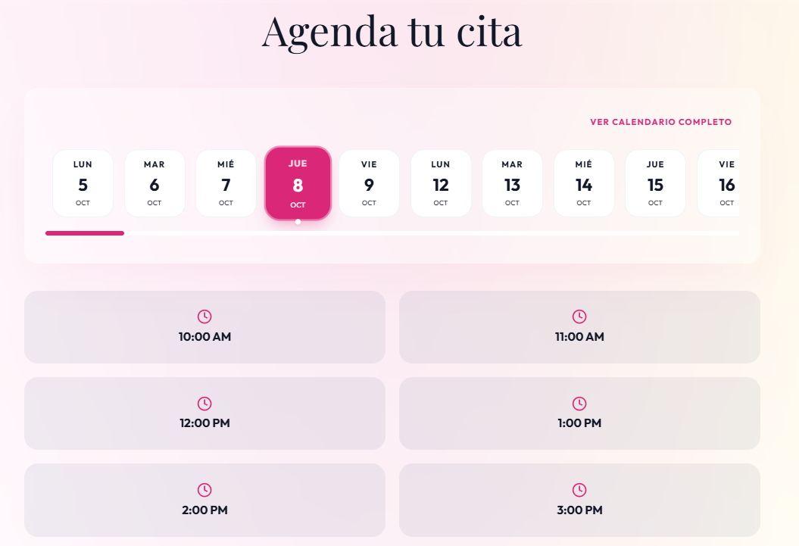
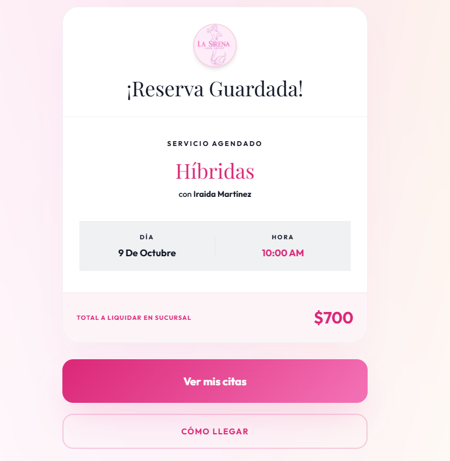
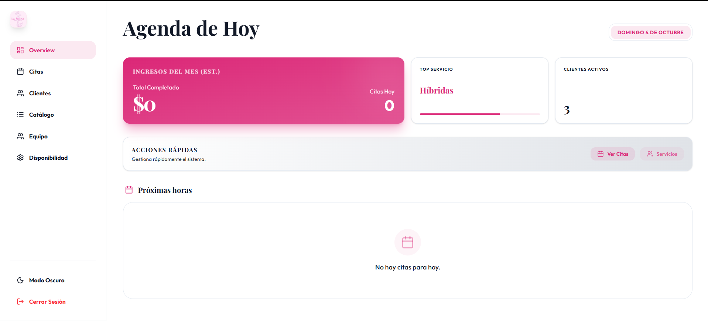

# La Sirena — Beauty Studio

**Creador:** Josué Martínez — [@Lalocarrito](https://github.com/Lalocarrito)

Web de reservas para un estudio de pestañas, en vivo en [lasirenahmo.com](https://lasirenahmo.com).
Tiene la página pública, un flujo de reserva paso a paso, perfil de clientas y panel de
administración. Hecha con Next.js y Supabase.

## Requisitos y ejecución

- Node.js 20+
- Un proyecto de Supabase

```bash
npm install
# crea .env.local con NEXT_PUBLIC_SUPABASE_URL, NEXT_PUBLIC_SUPABASE_ANON_KEY y SUPABASE_SERVICE_ROLE_KEY
# ejecuta supabase_schema.sql en el SQL Editor de Supabase
npm run dev
```

## Imágenes

| Público | Reserva |
|---|---|
|  |  |

| Reserva confirmada | Panel admin |
|---|---|
|  |  |
